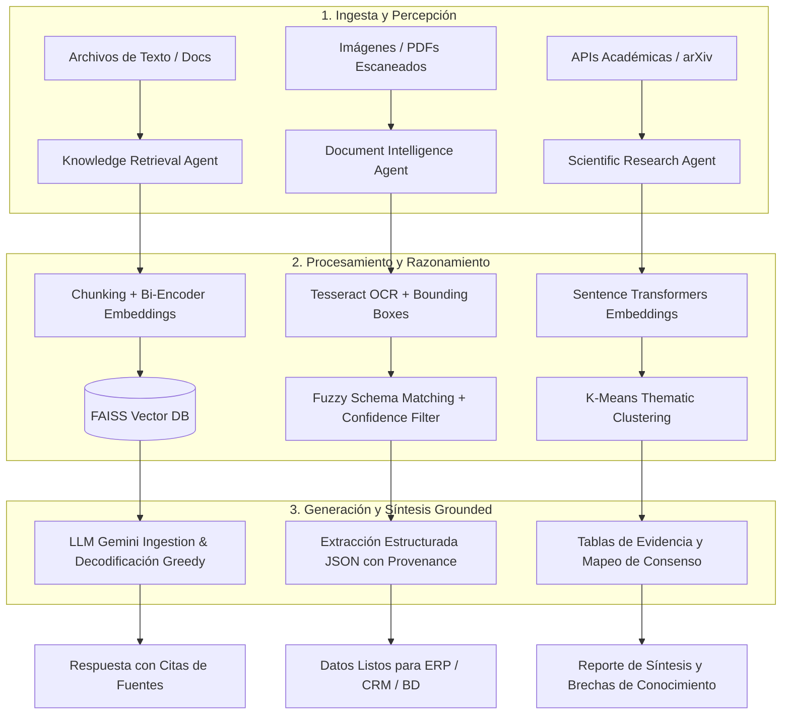

# Chapter 06: Information Retrieval & Knowledge Agents

Este módulo implementa la tríada de agentes de conocimiento descritos en el libro *30 Agents Every AI Engineer Must Build* (Capítulo 6). Estos agentes transforman modelos de lenguaje estáticos en sistemas fundamentados en evidencia empírica, estructuración de documentos y síntesis científica a gran escala.

---

## Arquitectura y Flujo de los Agentes

---
## Comparativa de los Agentes

| # | Agente | Rol Principal | Nivel de Capacidad | Tecnologías Clave |
| :--- | :--- | :--- | :--- |
| **04** | |Knowledge Retrieval AgentConectar LLMs con fuentes vivas mitigando alucinaciones (RAG denso)Nivel 2–3 (Tool-Using / Planning)LangChain LCEL, FAISS, Hugging Face, Google Gemini
| **05** |Document Intelligence AgentExtraer datos tabulares y campos clave de documentos no estructuradosNivel 2–3 (Tool-Using / Planning)Tesseract OCR, Pillow, RapidFuzz
| **06** | Scientific Research AgentEscaneo masivo, agrupamiento semántico y síntesis de literaturaNivel 4 (Learning & Discovery)arXiv API, SentenceTransformers, Scikit-Learn, PandasEstructura del RepositorioPlaintext

chapter_06_knowledge_agents/
├── .env.example
├── .gitignore
├── requirements.txt

├── README.md
├── 04_knowledge_retrieval_agent/
│   ├── docs/
│   │   └── sample_policy.txt
│   ├── agent.py
│   └── main.py
├── 05_document_intelligence_agent/
│   ├── agent.py
│   └── main.py
└── 06_scientific_research_agent/
    ├── agent.py
    └── main.py

Requisitos del Sistema y Configuración

1. Dependencias del Sistema Operativo (Linux / Ubuntu)Para el motor de OCR del Agente 05:Bashsudo apt update
sudo apt install -y tesseract-ocr poppler-utils

2. Configuración del Entorno Virtual PythonBashpython3 -m venv .venv
source .venv/bin/activate
pip install --upgrade pip
pip install -r requirements.txt

3. Variables de EntornoCopia el archivo .env.example a .env y configura tu clave de API:Bashcp .env.example .env
Contenido del .env:Extrait de codeGOOGLE_API_KEY="tu_google_gemini_api_key"
Ejecución de Pruebas

Agente 04 (Knowledge Retrieval):Bashpython

04_knowledge_retrieval_agent/main.py

Agente 05 (Document Intelligence):Bashpython 

05_document_intelligence_agent/main.py

Agente 06 (Scientific Research):Bashpython 

06_scientific_research_agent/main.py
