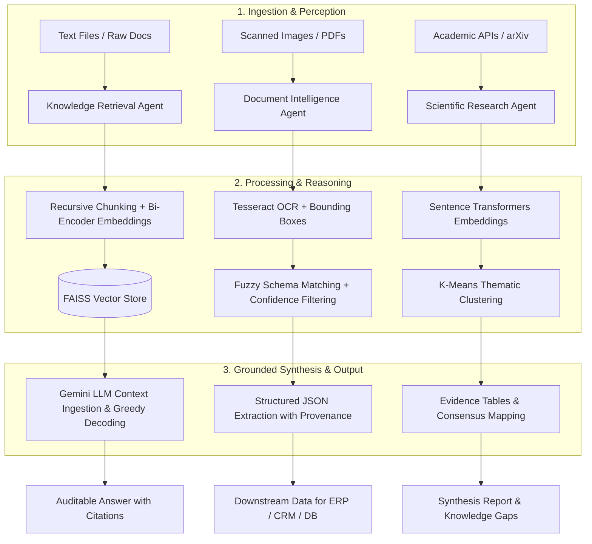

# Chapter 06: Information Retrieval & Knowledge Agents

This module implements the triad of knowledge agents described in the book *30 Agents Every AI Engineer Must Build* (Chapter 6). These agents transform static language models into dynamic systems grounded in empirical evidence, schema-driven document intelligence, and large-scale scientific synthesis.

---

## Agent Architecture and Workflow



---

## Agent Comparison

| # | Agent | Primary Role | Capability Level | Core Technologies |
| :--- | :--- | :--- | :--- | :--- |
| **04** | **Knowledge Retrieval Agent** | Connect LLMs to live data sources mitigating hallucinations (Dense RAG) | Level 2–3 (Tool-Using / Early Planning) | LangChain LCEL, FAISS, Hugging Face, Google Gemini |
| **05** | **Document Intelligence Agent** | Extract structured fields and spatial data from messy, unstructured documents | Level 2–3 (Tool-Using / Early Planning) | Tesseract OCR, Pillow, RapidFuzz |
| **06** | **Scientific Research Agent** | Literature scanning, semantic clustering, and cross-paper synthesis | Level 4 (Learning & Discovery) | arXiv API, SentenceTransformers, Scikit-Learn, Pandas |

---

## Repository Structure

```text
chapter_06_knowledge_agents/
├── .env.example
├── .gitignore
├── requirements.txt
├── README.md
├── 04_knowledge_retrieval_agent/
│   ├── docs/
│   │   └── sample_policy.txt
│   ├── agent.py
│   └── main.py
├── 05_document_intelligence_agent/
│   ├── agent.py
│   └── main.py
└── 06_scientific_research_agent/
    ├── agent.py
    └── main.py
```

---

## System Requirements & Setup

### 1. OS-Level Dependencies (Linux / Ubuntu)

Install the OCR engine and PDF rendering utilities required by Agent 05:

```bash
sudo apt update
sudo apt install -y tesseract-ocr poppler-utils
```

### 2. Python Virtual Environment Setup

```bash
python3 -m venv .venv
source .venv/bin/activate
pip install --upgrade pip
pip install -r requirements.txt
```

### 3. Environment Variables

Copy `.env.example` to `.env` and set your API credentials:

```bash
cp .env.example .env
```

Contents of `.env`:
```env
GOOGLE_API_KEY="your_google_gemini_api_key"
```

---

## Running the Agents

* **Agent 04 (Knowledge Retrieval):**
  ```bash
  python 04_knowledge_retrieval_agent/main.py
  ```

* **Agent 05 (Document Intelligence):**
  ```bash
  python 05_document_intelligence_agent/main.py
  ```

* **Agent 06 (Scientific Research):**
  ```bash
  python 06_scientific_research_agent/main.py
  ```

---

## AI Engineering Deep Dive

### 1. Mathematical Foundations and Vector Space

The retrieval agent implements a dense **Retrieval-Augmented Generation (RAG)** pipeline by mapping unstructured text into a continuous multidimensional vector space:

* **Dense Embeddings:** The `all-MiniLM-L6-v2` model is a distilled BERT transformer architecture (6 layers, 384 dimensions). It processes token sequences $T = (t_1, \dots, t_n)$ and applies mean pooling over the final hidden states to produce a normalized vector $\mathbf{v} \in \mathbb{R}^{384}$:
  $$\mathbf{v} = \frac{\sum_{i=1}^n \mathbf{h}_i}{\|\sum_{i=1}^n \mathbf{h}_i\|_2}$$
* **Semantic Similarity Metric:** Semantic proximity between query embedding $\mathbf{q}$ and document chunk embedding $\mathbf{d}_i$ is computed via inner product (identical to cosine similarity for $L_2$-normalized vectors):
  $$\text{Sim}(\mathbf{q}, \mathbf{d}_i) = \langle \mathbf{q}, \mathbf{d}_i \rangle = \cos(\theta) = \frac{\mathbf{q} \cdot \mathbf{d}_i}{\|\mathbf{q}\| \|\mathbf{d}_i\|}$$

### 2. In-Memory Indexing and Search (FAISS)

**FAISS** (*Facebook AI Similarity Search*) manages vector persistence and similarity queries using SIMD-optimized C++ routines:

* **Exact vs. Approximate Search:** Under the default configuration (`IndexFlatIP` / `IndexFlatL2`), it executes an exhaustive $k$-NN search with time complexity $\mathcal{O}(N \cdot d)$, where $N$ is the total number of chunks and $d = 384$.
* **Chunking Strategy:**
  * `chunk_size = 1000`: Bounds the atomic context window in characters to prevent embedding dilution.
  * `chunk_overlap = 200`: Retains a 20% sliding window to prevent syntactic clipping of named entities across chunk boundaries.

### 3. Graph Execution Pipeline (LCEL Execution Path)

The pipeline operates as a **Directed Acyclic Graph (DAG)** combining deterministic vector operations with probabilistic generation:

```text
[User Query] ──┬──> [HuggingFace Bi-Encoder] ──> [Vector Embedding q]
               │                                      │
               │                                      ▼
               │                              [FAISS k-NN Search]
               │                                      │
               │                                      ▼
               │                            [Top-k Document Chunks]
               │                                      │
               ▼                                      ▼
        [Prompt Template: Context Injection + Query Formatting]
                               │
                               ▼
            [LLM: Gemini 2.5 Flash Ingestion & Decoding]
                               │
                               ▼
                     [Grounded Response]
```

* **Query Transformation:** Encodes the raw query string into a dense vector via the local bi-encoder.
* **$k$-Nearest Neighbors Retrieval:** Extracts the top $k=3$ tensors with the lowest Euclidean distance / highest cosine similarity alongside metadata (`source`, `page_number`, `chunk_id`).
* **Context Stuffing:** Formats retrieved document chunks into plain text and injects them into the designated prompt context delimiters.
* **Conditioned Decoding:** The Gemini LLM computes token probabilities over a conditional distribution:
  $$P(Y \mid X_{\text{context}}, X_{\text{query}}) = \prod_{t=1}^T P(y_t \mid y_{<t}, X_{\text{context}}, X_{\text{query}})$$
  Setting `temperature = 0` enforces greedy decoding ($argmax$), minimizing generation entropy and suppressing unsupported extrapolations (hallucinations).

### 4. Engineering Trade-offs & Performance

| Dimension | Local Bi-Encoder (CPU) | Cloud API Embeddings |
| :--- | :--- | :--- |
| **Ingestion Latency** | $\sim 5\text{ ms}$ per chunk (zero network overhead) | $50\text{--}200\text{ ms}$ (subject to network latency & rate limits) |
| **Operating Cost** | $0 (local RAM computation) | Variable (billed per million tokens) |
| **Context Capacity** | 512 tokens max per chunk (BERT limit) | Up to 8192 tokens per vector |
| **Vector Privacy** | Data processed strictly in local memory | Encrypted payload transmitted to cloud endpoints |

### 5. Traceability and Provenance Tracking

The agent maintains strict data provenance by decoupling textual content from metadata storage:

* Each node in the vector index contains an immutable pointer back to its origin file (`docs/sample_policy.txt`).
* Upon execution, the pipeline returns both the synthesized response and the cited source metadata, enabling deterministic verification against zero-shot system constraints.
